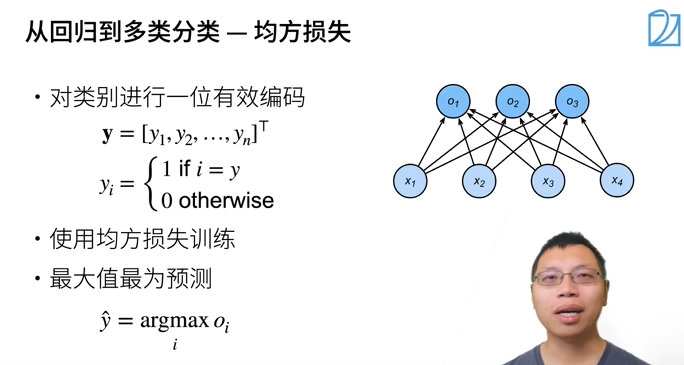
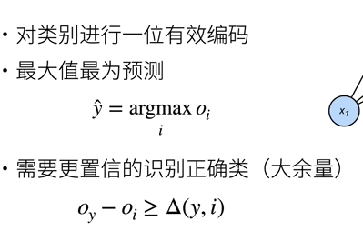
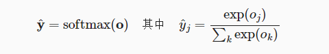
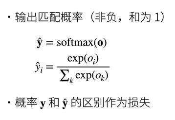
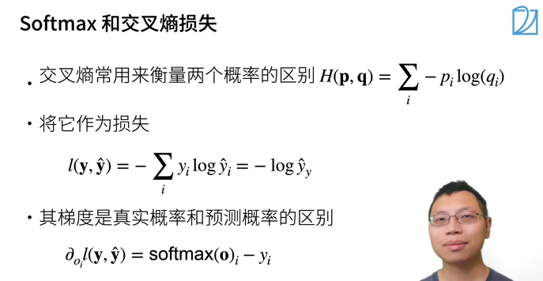
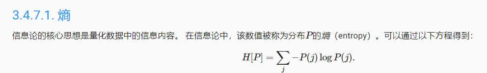

# 动手学深度学习-softmax回归

softmax是**分类**模型

回归：预测*多少*，估计一个连续值

- 单连续值输出
- 自然区间R
- 和真实值的区别作为损失

分类：预测*哪一个*，预测一个离散类别

- 引例：图像分类

- 通常多个输出

- 输出是是第i类的置信度

  

- 需要预测
- 输出是概率-在合适区间
- One-hot编码
- 使用均方损失训练
- 最大化置信度o_i置信度

o_y-o_i>=阈值 -- 分到正确类的置信度足够大

#### 引入操作子softmax() 激活函数

- softmax()是一种运算，获取一个向量并将其映射为概率

- y_hat=softmax(o)

- 

- 所有元素和为1，且所有元素非负数

  

  - 真实概率y：p_i=1 其他都为0
  
  - 为什么分类任务使用交叉熵而不是MSE：[参考链接](https://zhuanlan.zhihu.com/p/35709485)
  
    SSE,MSE,RMSE：[损失函数的使用](https://zhuanlan.zhihu.com/p/35707643)

#### 交叉熵：衡量两个概率的区别

#### 信息论基础

- softmax回归适用于分类问题。它使用softmax运算输出类别的概率分布。
- softmax回归是一个单层神经网络，输出个数等于分类问题中的类别个数。
- 交叉熵适合衡量两个概率分布的差异。

[d2l-v1交叉熵，讲得比第二版清晰](https://zh-v1.d2l.ai/chapter_deep-learning-basics/softmax-regression.html)
