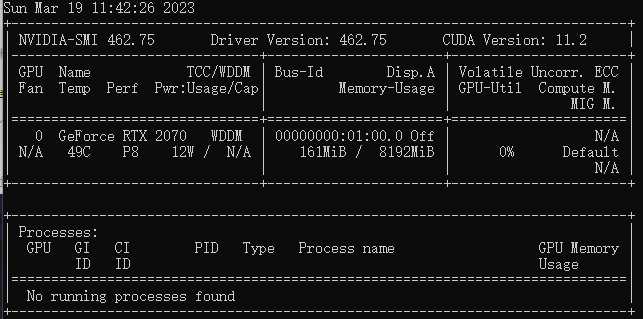
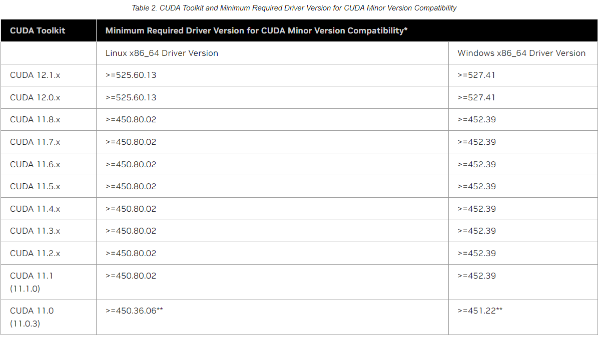
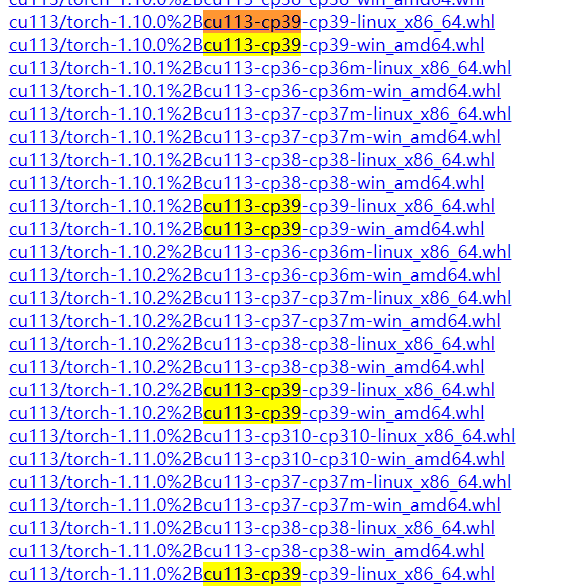
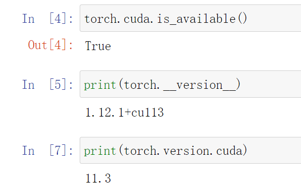

在学深度学习的过程需要在GPU运行pytorch，记录一下安装过程
之前因为安装tensorflow装过Cuda11.2，电脑上已有Anaconda
操作系统：Windows11 GPU:RTX2070

**从零开始安装cuda和pytorch的步骤可以参考李沐大神的视频：**
[Windows 下安装 CUDA 和 Pytorch 跑深度学习【动手学深度学习v2】](https://www.bilibili.com/video/BV18K411w7Vs/)
**步骤大致是：下载并安装Cuda->安装miniconda/Anaconda->conda/pip安装pytorch**，可以检查自己卡在哪一步了

## 问题

我安装好后在jupyter notebook中运行Torch,输入
```
import torch
torch.cuda.is_available()
```
返回

```
False
```

说明torch无法使用cuda

输入

```
print(torch.__version__)
```

返回

```
1.9.0+cpu
```

虽然使用conda安装了pytorch，但Pytorch是cpu版本的

## 检查

1. #### 检查显卡驱动

   命令行输入

   ```
   nvidia-smi
   ```

   

   驱动版本462.75，CUDA版本11.2

2. #### 检查Cuda版本

[nvidia官网]()查看显卡驱动对应版本的CUDA



可以看到CUDA11.2适用于453.39及以上版本的显卡驱动

3. #### 检查Pytorch版本

[各版本对应的安装Pytorch指令](https://pytorch.org/)

这里就有点坑了，官网给出了CUDA11.3和CUDA11.1的对应pytorch安装指令，但唯独没有CUDA11.2的…

重新安装了CUDA11.3对应的pytorch

需要注意的是：**pytorch对应的CUDA版本>=CUDA的版本** 

再运行cuda.is_available依然显示False

查看了[这个专栏](https://zhuanlan.zhihu.com/p/424837529)发现清华源下载的是pytorch-cpu= =

## 解决

在[官网下载库](https://download.pytorch.org/whl/torch_stable.html)下载Pytorch-gpu



大量参考了[这个专栏](https://zhuanlan.zhihu.com/p/424837529)，我自己理解的文件命名规则是

cuda版本号/torch版本号+cuda版本号+python版本+操作系统

所以要搜cuda11.2，Python3.9，Windows对应的torch包，查找

**cu113-cp39-cp39-win**

下载下来，使用pip安装：

```
# pip install 本地包地址
pip install C:\Download\torch-1.10.0+cu113-cp39-cp39-win_amd64.whl
```


