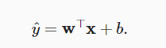

# 动手学深度学习-线性神经网络

### 线性回归+基础优化算法

引入：预测房价模型

- 假设1：影响房价的关键因素是卧室个数，卫生间个数和居住面积，记为x1 x2,x3
- 假设2：成交价是关键因素的加权和

**机器学习模型中的关键要素是训练数据、损失函数、优化算法，还有模型本身。**

#### 线性模型

原理：


- 线性模型可以被看成单层神经网络

- 神经网络缘于神经科学

  ​	输入 -> 在神经元里计算 -> 传递

#### 损失函数

- 损失函数是确定拟合程度的度量，用于量化实际值和预测值之间的差距

- 本例中采用均方误差（MSE）作为损失函数，乘1/2

- 最小化目标函数等价于执行极大似然估计

  

  

#### 训练数据

本例中训练数据由人工的w^T·**X**+b+**随机噪声（正态分布）**组成

#### 解析解

因为是线性回归，所以有显式解-精确唯一解

之后的很多模型没有显式解，可能有多个局部最优解

#### 优化算法

##### 梯度下降-随机梯度下降


学习率是超参数

具体原理可见d2l第11章

##### 随机梯度下降

由于梯度下降每次要遍历所有训练数据，时间开销很大，故每次随机采样训练数据中的一部分计算梯度

### 线性回归从零开始实现

```
%matplotlib inline
import random
import torch
from d2l import torch as d2l
```

给出w,x，创建wx+b+噪声的数据集

```
def synthetic_data(w,b,num_examples):
    X=torch.normal(0,1,(num_examples,len(w)))
    y=torch.matmul(X,w)+b
    y+=torch.normal(0,0.01,y.shape)
    return X,y.reshape((-1,1))

true_w=torch.tensor([2,-3.4])
true_b=4.2
features,labels=synthetic_data(true_w,true_b,1000)
```


生成小批量并打乱

```
# 该函数接受批量大小，特征矩阵，标签向量作为输入，生成大小为batch_size的小批量
def data_iter(batch_size,features,labels):
    num_examples=len(features)
    indices=list(range(num_examples))
    random.shuffle(indices)
    for i in range(0,num_examples,batch_size):
        batch_indices=torch.tensor(
        indices[i:min(i+batch_size,num_examples)])
        yield features[batch_indices],labels[batch_indices]

batch_size=10
```

```
# 初始化模型参数
w=torch.normal(0,0.01,size=(2,1),requires_grad=True)
b=torch.zeros(1,requires_grad=True)
```

定义线性模型

```
# 定义模型
def linreg(X,w,b):
    return torch.matmul(X,w)+b
```

定义随机梯度下降优化算法

```
# 定义优化算法 params参数包含w和b，lr学习率,batchsize批量大小
def sgd(params,lr,batch_size):
    with torch.no_grad():
        for param in params:
            param-=lr*param.grad/batch_size
            param.grad.zero_()
```

训练10次

```
lr=0.01
num_epochs=10
net=linreg
loss=squared_loss

for epoch in range(num_epochs):
    for X,y in data_iter(batch_size,features,labels):
        l=loss(net(X,w,b),y)
        #l是形状为（batchsize,1）的损失向量
        l.sum().backward()#反向传播求l对w,b的梯度
        sgd([w,b],lr,batch_size)#根据梯度更新w,b
    with torch.no_grad():
        train_l=loss(net(features,w,b),labels)
        print(f'epoch{epoch+1},loss{float(train_l.mean()):f}')
```


### 笔记

**python特性：x=x-k改变引用地址，x-=k不改变引用地址**

**with torch.no_grad() 的作用：**每一次更新params时**不让params对上一次的params求导**，即不生成计算图

- 如果某个tensor依赖的其他tensor中，有的的grad_require为true，但是这个当前这个tensor又确实不需要被求导，那么怎么把它的grad_fn设为None、grad_require设为false来节省内存？with torch.no_grad()就起强制设置的作用

- [参考资料](https://blog.csdn.net/IMchg/article/details/110235369)

- backward返回none，将梯度存在自变量.grad里

**重复使用y.backward()计算梯度时报错：**

```RuntimeError: Trying to backward through the graph a second time (or directly access saved tensors after they have already been freed)```

- 是因为计算梯度的过程中，计算图就被破坏（释放）了，如果需要保留计算图可以使用```y.backward(retain_graph=True)```

- detach的作用：把一个节点变为requires_grad=False

- [参考资料](https://blog.csdn.net/SY_qqq/article/details/107384161)

**超参数learning_rate**

- 学习率太小：梯度每次下降步长小，收敛太慢

- 学习率太大：步长太大直接越过最小值，可能发散

#### 简洁实现

```
import numpy as np
import torch
from torch.utils import data
from d2l import torch as d2l

true_w=torch.tensor([2,-3.4])
true_b=torch.tensor([4.2])
features,labels=d2l.synthetic_data(true_w,true_b,1000)
```

生成小批量并打乱

```
def load_array(data_arrays,batch_size,is_train=True):
    dataset=data.TensorDataset(*data_arrays)
    return data.DataLoader(dataset,batch_size,shuffle=is_train)

batch_size=10
data_iter=load_array((features,labels),batch_size)
next(iter(data_iter))
```

线性模型-单层nn

```
from torch import nn

net=nn.Sequential(nn.Linear(2,1))
#Sequential is a list of layers
```

初始化权重和偏差

```#初始化权重和偏差
net[0].weight.data.normal_(0,0.01)
net[0].bias.data.fill_(0)
```

损失函数

```
#均方误差,也称为平方范数
loss=nn.MSELoss()
```

随机梯度下降优化

```
#实例化SGD,随机梯度下降优化
trainer=torch.optim.SGD(net.parameters(),lr=0.03)
```

训练

```
num_epochs=3
for epoch in range(num_epochs):
    for X,y in data_iter:
        l=loss(net(X),y)
        trainer.zero_grad()
        l.backward()
        trainer.step()
    l=loss(net(features),labels)
    print(f"epoch {epoch+1},loss {l:f}")
```

